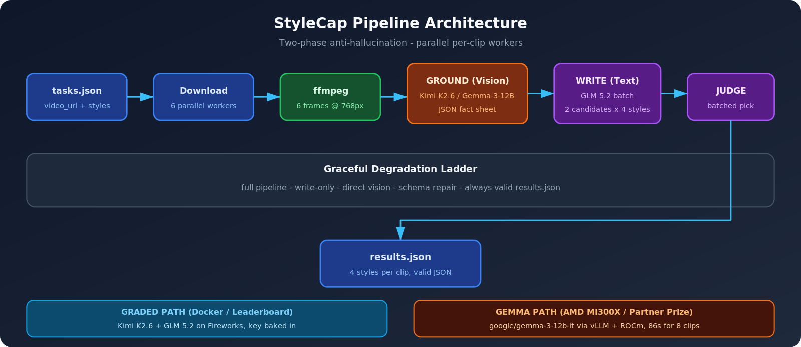

# StyleCap — Grounded Multi-Style Video Captioning

**AMD Developer Hackathon ACT II · Track 2**  
Containerized agent that watches short video clips and writes **four grounded caption styles** (formal, sarcastic, humorous-tech, humorous-non-tech).

| | |
|---|---|
| **Team** | QuantumByte-01 |
| **GitHub** | [quantibyte](https://github.com/QuantumByte-01) |
| **Contact** | swastik.r.900@gmail.com |

---

## Submission links (lablab Step 3)

Copy these into the hackathon form:

| Field | Value |
|-------|-------|
| **GitHub Repository** | https://github.com/QuantumByte-01/amd-track2-captioner |
| **Demo Application Platform** | GitHub |
| **Demo Application URL** | https://github.com/QuantumByte-01/amd-track2-captioner#quick-start |
| **Docker Image** | `ghcr.io/quantumbyte-01/amd-track2-captioner:v40` |

Also available: `ghcr.io/quantumbyte-01/amd-track2-captioner:latest` (same digest as latest `v<N>` build).

**Slides:** [StyleCap_Slides.pdf](StyleCap_Slides.pdf)  
**Gemma on AMD MI300X evidence:** [GEMMA_RESULTS.md](GEMMA_RESULTS.md) · [samples/gemma_results.json](samples/gemma_results.json)

---

## What it does

1. **Download** clips in parallel (6 workers)
2. **Sample** 6 frames per clip with ffmpeg (uniform seek, 768px)
3. **Ground** — vision model extracts a strict JSON fact sheet (anti-hallucination)
4. **Write** — text model batches 2 candidates per requested style
5. **Judge** — one batched call picks the best caption per style
6. **Repair** — length policy, schema validation, degradation ladder → always valid `results.json`



---

## Quick start (graded Docker image)

```bash
docker pull ghcr.io/quantumbyte-01/amd-track2-captioner:v40

mkdir -p input output
# tasks.json: list of {task_id, video_url, styles[]}
docker run --rm \
  -v "$PWD/input:/input" \
  -v "$PWD/output:/output" \
  ghcr.io/quantumbyte-01/amd-track2-captioner:v40

cat output/results.json
```

**Input** (`/input/tasks.json`):

```json
[
  {
    "task_id": "v1",
    "video_url": "https://storage.googleapis.com/amd-hackathon-clips/1860079-uhd_2560_1440_25fps.mp4",
    "styles": ["formal", "sarcastic", "humorous_tech", "humorous_non_tech"]
  }
]
```

**Output** (`/output/results.json`):

```json
[
  {
    "task_id": "v1",
    "captions": {
      "formal": "...",
      "sarcastic": "...",
      "humorous_tech": "...",
      "humorous_non_tech": "..."
    }
  }
]
```

---

## Models

### Leaderboard path (Docker / Fireworks serverless)

| Role | Model |
|------|-------|
| Vision / ground | `accounts/fireworks/models/kimi-k2p6` |
| Caption / judge | `accounts/fireworks/models/glm-5p2` |
| API | `https://api.fireworks.ai/inference/v1` |

`FIREWORKS_API_KEY` is baked at image build time (Track 2 rules). GHCR package is **public**.

### Gemma path (AMD MI300X partner demo)

The **same pipeline** runs end-to-end on `google/gemma-3-12b-it` via vLLM + ROCm on AMD Instinct MI300X — ground, write, and judge. See [GEMMA_RESULTS.md](GEMMA_RESULTS.md) for timings (8 clips in **86s**) and sample output.

```bash
export LLM_BASE_URL=http://localhost:8000/v1
export MODEL_VISION=google/gemma-3-12b-it
export MODEL_CAPTION=google/gemma-3-12b-it
export MODEL_FALLBACK=google/gemma-3-12b-it
export FIREWORKS_API_KEY=dummy
python run.py
```

---

## Local development

```bash
pip install -r requirements.txt
export FIREWORKS_API_KEY=your_key
python eval/eval.py          # score against reference captions
```

## Project structure

```
run.py              # orchestrator + degradation ladder
src/                # config, llm, video, ground, caption, judge, schema
prompts/            # ground, write, judge prompts
eval/               # local eval harness + reference captions
samples/            # Gemma run output (8 public clips)
Dockerfile          # linux/amd64 submission image
```

## License

MIT — see [LICENSE](LICENSE).
